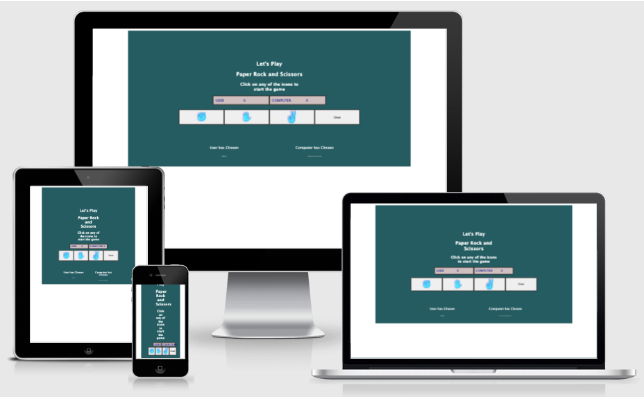
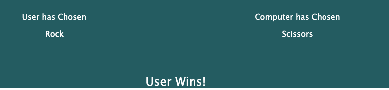

# Rock, Paper, Scissors - The Ultimate Dueling game
## About 

The game was built upon the schoolyard game of Rock, Paper, Scissors enjoyed by both kids and adults alike. What makes this game unique is you get to play against the computer's random choice.

Because the game is based on the random choice of the computer then the game is based solely on luck.

Why not have a go to see if you can beat the computer [Live Deployment](https://soconne339.github.io/soconne338-project2/)

## Responsive Design

The game works on all platforms and is fully responsive. 

## User Experience

The UX of this website is very much taken into consideration during its design. The information is clear and the colour scheme is specifically chosen to display contrast between the main elements and the background. From the outset it’s obvious what the user needs to do. The text on the button reads “Let’s play Rock, Paper, Scissors”. Feedback is given in the way the game starts up.

The page is divided into 3 sections. The first section shows the scoreboard. Note how the background color of the scoreboard contrasts against the background. 

The second section is made up of 4 buttons. These are the buttons that the user must press in order to start the game. They are the largest element on the page and stand out as the main target point. When the cursor hovers over the buttons, the background color changes to a darker hue and the cursor changes to a pointer. This again provides feedback to the user that these need to tbe clicked tap.

The last section shows the choices made by the user and by the computer. I've made a special effort to surround this information with empty space as it allows the user to focus on the important information. The user's choice is on the left hand side and the computer's choice is on the right hand side. Underneath each of the choices is the text, centre aligned, announcing who won that round of the game.

To reset the scoreboard and start the game again the user needs to click on the clear button to the right of the game button choices. The button is designed like the other buttons but the text clear is displayed and is obvious what the user needs to do. 

## Wireframes

Here are the wireframes for this website

[starting screen](./assets/images/wireframe-initial-page.pdf)

[main screen](./assets/images/wireframe-main-game.pdf)

## The Ideal Client for This Website 

1. English Speaking
2. Someone who is in the age group of 20-30
3. Someone who is looking to kill a bit of time
4. Someone who is bored and looking for something to do online

## Skeleton

This website is a Single page website made up of two parts. All of the content is hidden before pressing the button. The tools to play the game are distinctly labelled. All of the necessary information is set out on this page. There is no need to go to any other pages on the site.

## Validation

This website has passed the following validations:

- W3C Validation — [https://validator.w3.org/](https://validator.w3.org/)
- Jigsaw CSS Validation - [https://www.jslint.com/](https://www.jslint.com/)
- Javascript JSLint Validation - [https://www.jslint.com/](https://www.jslint.com/)

## User Stories

1. The game seemed straightforward on how to play. Perhaps the scoreboard should stop when it gets to 10 - Female age 53
2. I like that each of the pictures is big and easy to tap - Male age 5
3. I figured out that clicking on the scissors icon again and again allows me to win - Female age 38

## Issues/Bugs

### Issue 1
None of the buttons worked on the browser but in JSFiddle it was working without any problem. 
- This was resolved by placing the script tag at the end of the HTML file. The DOM needs to loads first before the javascript kicks in.

### Issue 2
An issue was found whereby clicking on the buttons sometimes didn’t activate the event handler
- The issue was resolved by adding data-id and using this as the target. Clicking on images now works all the time.

### Issue 3
Issue with the start button not disappearing
- Issue resolved by creating a new class with CSS property visibility:hidden and adding this class to the button

### Issue 4
Issue with not being able to center the image beside start button
- Issue resolved by adding position: relative 

## Deployment

This website was published using GitHub Pages. The procedure is outlined below:
- Navigate to settings on the GitHub Page
- Create new respository
- From the source section drop-down menu, select the Master Branch
- Once the master branch has been selected, the page will be automatically refreshed with a detailed ribbon display to indicate the successful deployment.

## Credits

A lot of help for the javascript for this project was thanks to [Dev Ed Youtube Channel](https://www.youtube.com/channel/UClb90NQQcskPUGDIXsQEz5Q). Particularly to his video on creating a Rock Paper Scissors [YouTube Video](https://www.youtube.com/watch?v=qWPtKtYEsN4&t=2331s). Please note that none of the code was taken from this video

Thanks to my mentor Guido for helping me debug a large Javascript problem

Thanks to Matt Bodden_5P for troubleshooting my issue on Slack

Thanks to my friends and family who beta tested this application and gave some pointers.

